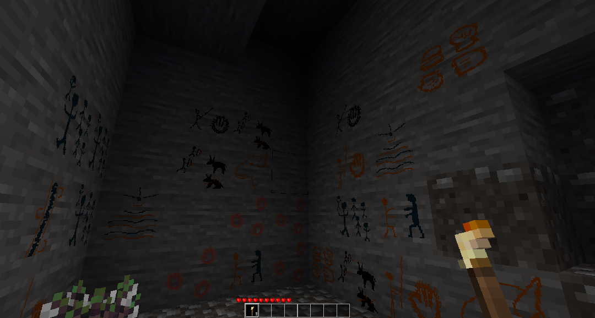

CC0 Farfadet46

MOD PEINTURES RUPESTRE POUR LUANTI (Ex-Minetest)

But: permettre aux enfants de décorer leurs grottes, ajouter / modifier leurs propres textures 
(le code init.lua à été pensé dans ce sens ; une suele variable à modifier pour déterminer le nombre de blocs à créer)

Capture d'écran :

